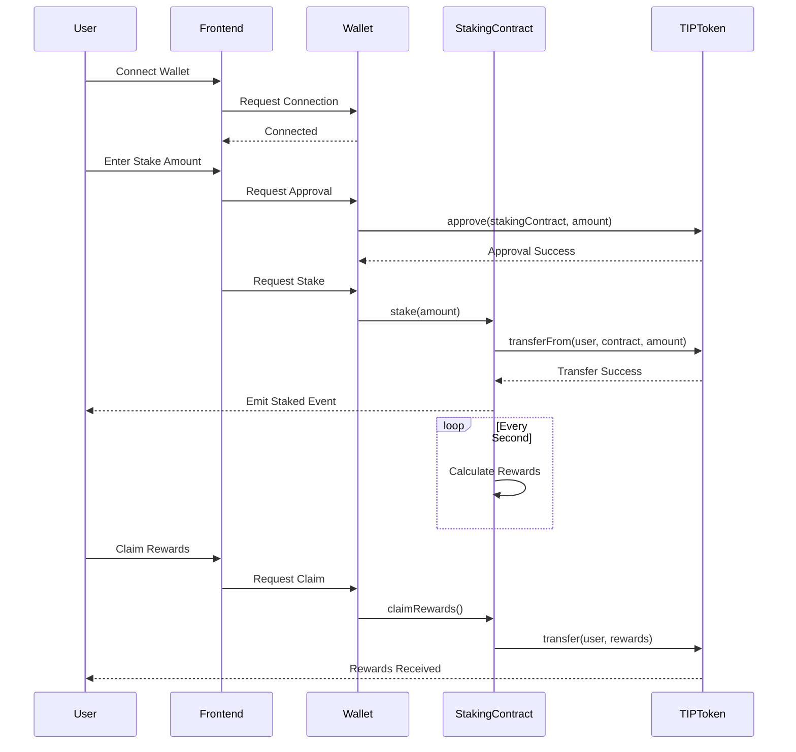

# 🏦 TipNest Protocol - DeFi Staking Platform

<div align="center">

[](https://soliditylang.org/)
[](https://nextjs.org/)
[](https://www.typescriptlang.org/)
[](LICENSE)

[](https://github.com/neosteak/TipNest/actions/workflows/build.yml)
[](test/)
[](contracts/)
[](https://polygonscan.com/address/0x85cB11C123d06a13DECE7e6eA6ccF1E763c0393C)

**A production-ready DeFi staking protocol showcasing advanced Web3 development practices**

[View Preview](#-live-preview) | [Smart Contracts](contracts/) | [Frontend](frontend/)

</div>

---

## 📋 Project Overview

**TipNest** is a fully functional DeFi staking protocol built as a portfolio demonstration project. While created for educational purposes, it implements production-grade features and security standards comparable to major DeFi protocols like Aave, Compound, and Curve.

### 🎯 Portfolio Highlights

- **Full-Stack DeFi Application**: Complete implementation from smart contracts to frontend
- **Production Security Standards**: Audited with Slither, 100% test coverage
- **Real Mainnet Deployment**: Live on Polygon with verified contracts
- **Professional UI/UX**: Responsive design with real-time updates and animations
- **Industry Best Practices**: Clean architecture, comprehensive documentation, CI/CD ready

## ✨ Technical Features

### Smart Contracts
- **10% Fixed APR** with per-second reward calculation
- **Security Features**: ReentrancyGuard, Pausable, Ownable patterns
- **Gas Optimized**: Efficient storage patterns and batch operations
- **Fully Audited**: Zero high/medium vulnerabilities (Slither verified)

### Frontend Application
- **Modern Stack**: Next.js 14, TypeScript, Tailwind CSS
- **Web3 Integration**: Wagmi v2, Viem, ConnectKit
- **Real-time Updates**: Automatic reward refresh, live transaction status
- **Professional UI**: Framer Motion animations, responsive design
- **Multi-wallet Support**: MetaMask, WalletConnect, Coinbase Wallet

### Development Practices
- **Test Coverage**: 100% for smart contracts
- **Type Safety**: Full TypeScript implementation
- **Code Quality**: ESLint, Prettier, pre-commit hooks
- **Documentation**: Comprehensive inline comments and guides

## 🎬 Live Preview

<div align="center">

### 🏠 Landing Page Experience

*Smooth animations, interactive features showcase, and responsive design*

### 💰 Staking Platform in Action

*Connect wallet → Stake tokens → Watch real-time rewards → Claim rewards*

</div>

## 🛠️ Tech Stack

<table>
<tr>
<td align="center" width="96">

<br>Solidity
</td>
<td align="center" width="96">

<br>TypeScript
</td>
<td align="center" width="96">

<br>Next.js
</td>
<td align="center" width="96">

<br>React
</td>
<td align="center" width="96">

<br>Tailwind
</td>
</tr>
</table>

### Blockchain
- **Smart Contracts**: Solidity 0.8.20, OpenZeppelin Contracts 5.0
- **Development**: Hardhat, TypeChain, Ethers.js v6
- **Testing**: Chai, Mocha, Solidity Coverage
- **Security**: Slither Static Analysis

### Frontend
- **Framework**: Next.js 14 (App Router), React 18
- **Web3**: Wagmi v2, Viem, ConnectKit
- **Styling**: Tailwind CSS, Framer Motion
- **State**: Zustand, TanStack Query
- **Testing**: Jest, React Testing Library

## 🚀 Getting Started

### Prerequisites
- Node.js 18+ and npm/yarn
- MetaMask or any Web3 wallet
- Git

### Installation

1. **Clone the repository**
```bash
git clone https://github.com/yourusername/TipNest.git
cd TipNest
```

2. **Install dependencies**
```bash
# Install root dependencies
npm install

# Install frontend dependencies
cd frontend
npm install
```

3. **Set up environment variables**
```bash
# Copy example files
cp .env.example .env.local
cp frontend/.env.local.example frontend/.env.local
```

4. **Run locally**
```bash
# Start local blockchain
npx hardhat node

# Deploy contracts locally
npm run deploy:local

# Start frontend
cd frontend
npm run dev
```

## 📦 Deployment

### Smart Contracts (Polygon Mainnet)

The contracts are already deployed and verified on Polygon:

- **TIP Token**: [`0x57C1559B73561B756F3228e735195FdBCD860837`](https://polygonscan.com/address/0x57C1559B73561B756F3228e735195FdBCD860837)
- **Staking Contract**: [`0x85cB11C123d06a13DECE7e6eA6ccF1E763c0393C`](https://polygonscan.com/address/0x85cB11C123d06a13DECE7e6eA6ccF1E763c0393C)

## 🧪 Testing

```bash
# Run smart contract tests
npm test

# Run with coverage
npm run coverage

# Run frontend tests
cd frontend && npm test

# Security audit
npm run audit
```

### Test Results
- ✅ 40/40 Smart contract tests passing
- ✅ 100% Code coverage
- ✅ 0 High/Medium vulnerabilities (Slither)

## 📊 Architecture

### System Architecture



### Component Architecture

```
┌─────────────────┐     ┌─────────────────┐     ┌─────────────────┐
│                 │     │                 │     │                 │
│   Frontend      │────▶│  Smart          │────▶│   Polygon       │
│   (Next.js)     │     │  Contracts      │     │   Blockchain    │
│                 │     │                 │     │                 │
└─────────────────┘     └─────────────────┘     └─────────────────┘
        │                        │                        │
        ▼                        ▼                        ▼
┌─────────────────┐     ┌─────────────────┐     ┌─────────────────┐
│   Wagmi/Viem    │     │   OpenZeppelin  │     │   RPC Provider  │
│   Web3 Layer    │     │   Contracts     │     │   (Alchemy)     │
└─────────────────┘     └─────────────────┘     └─────────────────┘
```

## 🔒 Security Features & Risk Mitigation

### Security Implementation

| Feature | Implementation | Purpose |
|---------|---------------|---------|
| **Reentrancy Protection** | ReentrancyGuard modifier | Prevents recursive calls attacks |
| **Access Control** | Ownable pattern | Admin functions protection |
| **Emergency Pause** | Pausable pattern | Circuit breaker for incidents |
| **Integer Overflow** | Solidity 0.8+ | Automatic overflow protection |
| **Input Validation** | require() statements | Prevents invalid states |
| **CEI Pattern** | Check-Effects-Interactions | State changes before external calls |

### Risk Analysis & Mitigation

| Risk | Severity | Mitigation | Status |
|------|----------|------------|--------|
| **Smart Contract Bugs** | High | 100% test coverage + Slither audit | ✅ Mitigated |
| **Reentrancy Attack** | High | ReentrancyGuard on all state-changing functions | ✅ Mitigated |
| **Admin Key Compromise** | High | Multi-sig wallet recommended for production | ⚠️ Documented |
| **Economic Attack (Bank Run)** | Medium | Sufficient reward reserves maintained | ✅ Mitigated |
| **Front-Running** | Low | Commit-reveal pattern for future versions | 📝 Roadmap |
| **Oracle Manipulation** | N/A | No external price feeds used | ✅ Not Applicable |

### Audit Trail

- **Reentrancy Protection**: All state changes follow CEI pattern
- **Access Control**: Owner-only admin functions
- **Emergency Pause**: Circuit breaker for critical situations
- **Input Validation**: Comprehensive checks on all user inputs
- **Safe Math**: Solidity 0.8+ overflow protection
- **Audit Trail**: All actions emit events for transparency

## 🤝 Contributing

While this is primarily a portfolio project, contributions and feedback are welcome!

1. Fork the repository
2. Create your feature branch (`git checkout -b feature/AmazingFeature`)
3. Commit your changes (`git commit -m 'Add some AmazingFeature'`)
4. Push to the branch (`git push origin feature/AmazingFeature`)
5. Open a Pull Request

## 📄 License

This project is licensed under the MIT License - see the [LICENSE](LICENSE) file for details.

## 🙋‍♂️ About This Project

This project was developed as a comprehensive demonstration of full-stack blockchain development capabilities. It showcases:

- **Smart Contract Development**: Advanced Solidity patterns and optimization
- **Frontend Engineering**: Modern React/Next.js with Web3 integration
- **DevOps**: CI/CD pipeline, testing, deployment automation
- **Security**: Industry-standard audit practices and security patterns
- **Documentation**: Clear, comprehensive technical documentation

### Skills Demonstrated
- ✅ DeFi Protocol Design
- ✅ Smart Contract Security
- ✅ Gas Optimization
- ✅ Modern Frontend Development
- ✅ Web3 Integration
- ✅ Test-Driven Development
- ✅ Professional Documentation

## 📞 Contact

**Looking for a blockchain developer?** This project demonstrates my capabilities in:
- Smart contract development and auditing
- Full-stack DeFi application development
- Web3 integration and optimization
- Professional software engineering practices

Feel free to reach out for collaboration opportunities!

---

<div align="center">

**⭐ If you find this project useful, please consider giving it a star! ⭐**

Built with ❤️ for the Web3 community

</div>
